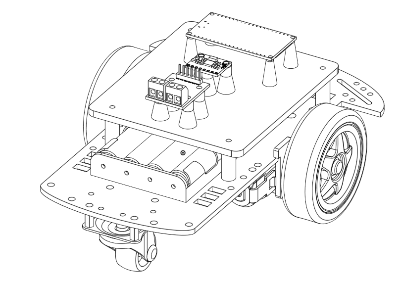

# DHEX

### Introduction

This repo contains ROS packages for simulating the DHEX vehicle, it also contains .ino files for micro controller. DHEX is a differential robot, which has an encoder and IMU sensor for odometry. Additionally, it has an ESP32 for wifi connection using rosserial, for controlling the motor and for reading sensors. The robot model was made considering the mass of real parts, in order to get a more realistic simulation. Images and gifs below shows DHEX in simulation, in real life and in CAD.

  

  

### Simulation Video

### Supported versions

This work was developed and tested under [Ubuntu 18.04 LTS](https://ubuntu.com/#download) using [ROS Melodic Morenia](http://wiki.ros.org/melodic/Installation/Ubuntu). This software may work on other platforms.

---

### Optional

* Install the teleop_twist_keyboard: `$ sudo apt-get install ros-melodic-teleop-twist-keyboard`

### How to install

Inside the catkin_workspace folder, which can be created by following this [ROS tutorial](http://wiki.ros.org/ROS/Tutorials), clone our repository or download it as a ZIP file and extract it there.

Then, inside the catkin_workspace/src folder, build the workspace with `$ catkin_make`

### How to execute

In order to run the simulation in Gazebo, proceed with sourcing your workspace with `source devel/setup.bash`, then launching the following:
1. `$ roslaunch dhex_description dhex_simulation.launch`
2. `$ roslaunch dhex_description rviz.launch`
3. `$ roslaunch dhex_localization dhex_localization.launch`
4. `$ rosrun teleop_twist_keyboard teleop_twist_keyboard.py cmd_vel:=/dhex/cmd_vel` or publish on topic `/dhex/cmd_vel` to move the robot.
